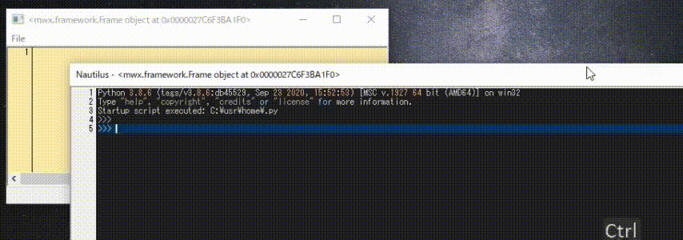
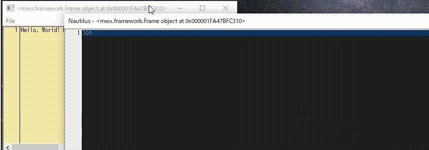
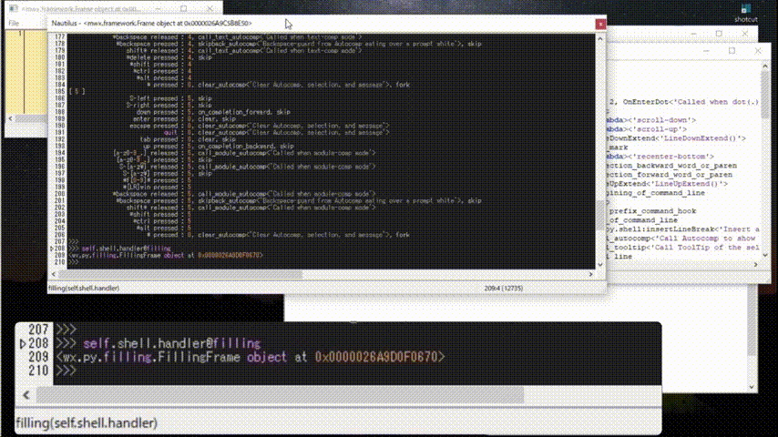

# mwxlib

My python package based on matplotlib/wx

See [Demo Script and Gallery](./demo/index.md).


## Getting Started

These instructions will get you a copy of the project up and running on your local machine for development and testing purposes. See deployment for notes on how to deploy the project on a live system.

### Prerequisites

- Python 2.7
- Python 3.x
    - numpy
    - pillow
    - matplotlib
    - wxpython >= 4.0.7

### Installing

Beofre installing, you can check how mwxlib works.
Enter the src directory (mwxlib/Lib), and type (cf. framework is the mastar source of mwxlib)
```
$ py -3 -m framework 
```
To install, enter the root directory (./mwxlib), then type
```
$ py -3 setup.py install
```
To install from GitHub, type
```
$ py -3 -m pip install git+https://github.com/komoto48g/mwxlib.git
```

### How to use

```python
>>> from mwx import deb
>>> deb()
```

The more pragmatic sample is 'debut.py'.
Enjoy diving!

### Uninstalling
<!--
```sh
$ py -3 setup.py install --record files.txt
$ cat files.txt | xargs rm -rf
```
次のやつでＯＫぽい
-->
```sh
$ pip uninstall mwxlib
```


# Features

## Fearture of mwx.framework

The framework has an extended class based on wx.py.shell.Shell named Nautilus,
which has the following features:

1. Auto-completion and apropos functions are reinfoced.
    - [1] history-comp-mode
    - [2] word-comp-mode
    - [3] apropos-comp-mode
    - [4] text-comp-mode
    - [5] module-comp-mode
1. Objective magic syntax is implemented.
    - [ ` ] backquote
    - [@] pullback
1. Powerful inspectoin utillities are compiled.
    - Filling
    - InspectionTool
    - Ghost in the shell

**All objects in the process can be accessed using,**
```
    self : the target of the shell,
    this : the module which includes target.
```

**It is very easy to include the shell in your wxPython application.**
```python
>>> self.inspector = mwx.InspectorFrame(self, target=self)
```
As you are diving into the python process,
you can watch, inspect, and change everything in the target.


The animation shows how the Nautilus works, which is embedded in a simple PyEditor app.


## Autocomp key bindings:
        C-up : [0] retrieve previous history
      C-down : [0] retrieve next history
    M-j, C-j : [0] call tooltip of eval (for the word selected or focused)
    M-h, C-h : [0] call tooltip of help (for the func selected or focused)
         TAB : [1] history-comp-mode
         M-p : [1] retrieve previous history in comp-mode
         M-n : [1] retrieve next history in comp-mode
         M-. : [2] word-comp-mode
         M-/ : [3] apropos-comp-mode
         M-, : [4] text-comp-mode
         M-m : [5] module-comp-mode
  * All completions [1--5] are incremental when pressed any alnums, and decremental when backspace.




## Magic syntax:

  - backquote : ```x`y --> y=x  | x`y`z --> z=y=x```

  - pullback : ```x@y --> y(x) | x@y@z --> z(y(x))```

  - apropos : ```x.y? [not] p => shows apropos &optional (not-)matched by p:predicates```
                equiv. apropos(y, x [,ignorecase ?:True,??:False] [,pred=p])
                y can contain regular expressions.
                    (RE) \\a:[a-z], \\A:[A-Z] can be used in addition.
                p can be ?atom, ?callable, ?instance(*types), and
                    predicates imported from inspect
                    e.g., isclass, ismodule, ismethod, isfunction, etc.
  
  * info :  ?x (x@?) --> info(x) shows short information
  * help : ??x (x@??) --> help(x) shows full description
  * sx   :  !x (x@!) --> sx(x) executes command in external shell
    
    Note: The last three (*) are original syntax defined in wx.py.shell,
    at present version, enabled with USE_MAGIC switch being on


## Shell built-in utility:
    @p          synonym of print
    @pp         synonym of pprint
    @puts       same as p but put it into the prompt
    @info   @?  short info
    @help   @?? full description
    @dive       clone the shell with new target
    @timeit     measure the duration cpu time
    @execute    exec in the locals (PY2-compatible)
    @filling    inspection using wx.lib.filling.Filling
    @watch      inspection using wx.lib.inspection.InspectionTool
    @edit       open with your editor (undefined)
    @file       inspect.getfile -> str
    @code       inspect.getsource -> str
    @module     inspect.getmodule -> module
    @fileno     (file, line-number)


## Ghost in the shell

The Ghost in the shell (g.i.t.s) is the help system for divers,
which is a notebook-style window consists of four editors:
- scratch buffer
    + a temporary buffer used as big-tooltip
- Help buffer
    + for piping text from help() and info()
- Logging buffer
    + for logging Clipboard communication across the shell
    + free memo space
- History buffer
    + read-only buffer of the input-history


The animation shows how to inspect *blurring*-functions of OpenCV.


## Authors

* Kazuya O'moto - *Initial work* -

See also the list of who participated in this project.


## License

This project is licensed under the MIT License - see the [LICENSE](./LICENSE) file for details
