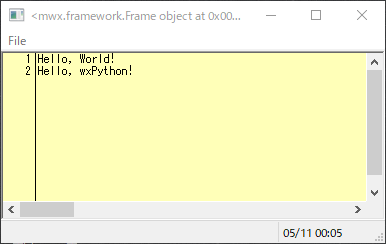
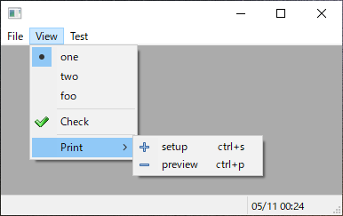
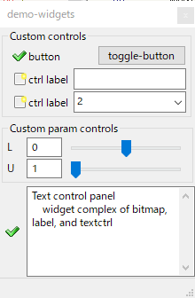
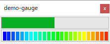
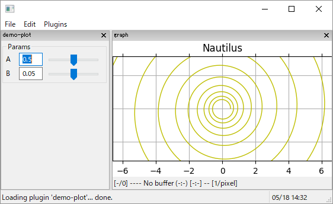
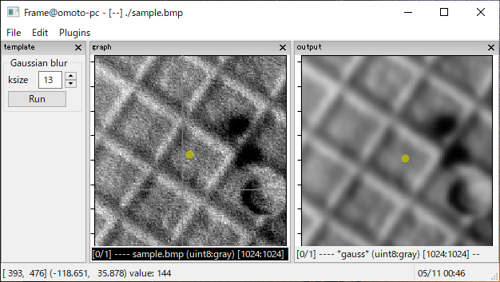

# Demo Script and Gallery

## mwx.FSM

The theory of Finite State Machine (FSM), developed in mid 20th century, is one of the most useful models in system design. The catalog of techniques that are simplified by FSM is astonishing: text processing, compilers, hardware design, language, AI, and much more. 
The FSM is also the most important framework of mwxlib and used for the key-mouse-event binder, inter-object communication, notify handler, thread-sentinel, and so on.
As with most mathematical and physical ideas which are truly fundamental, the concept of the Finite State Machine (FSM) is very simple.

Check how the mwx.FSM works by running the test code:
[test-script of gate keeper](./test_fsm.py).

## mwx.Frame

The simplest frame, which consists of 
- simple menubar
- simple statusbar
- simple shell

<!--
[test-script](./test_frame.py)

-->

## mwx.Button

- The button is based on <wx.lib.platebtn>
- The panel is based on <wx.lib.scrolledpanel>, and extended to be foldable. (try it!)

[demo-icons](./demo-icons.py)
.png)
.png)

## mwx.menubar

The mwx.menubar is described as structured list.
Designed as WYSiWYG (see demo-code).

[test_menubar](./test_menubar.py)

## mwx.controls

The mwx.controls including,
- Knob
    - Param
    - LParam (linear Param)
- Button
- ToggleButton
- TextCtrl (text and button complex)
- Choice (text and combobox complex)

Those wx controls (not only shown above) are laid out by only one method `layout` of mwx.ControlPanel<wx.lib.scrolled.ScrolledPanel> as WYSiWYG (see demo-code).

[demo-widgets](./demo-widgets.py)

[demo-gauge](./demo-gauge.py)

[demo-plot](./demo-plot.py)

## mwx.graphman.Layer

The graphman is a graphic window manager.
- Thread
- Layer (base of Plugins)
- Graph (matplotlib panel)
- Frame
    - two window matplotlib graphic window
    - stack frames
    - layer manager (load/unlodad/edit/inspect)
    - image loader (PIL)
    - index loader
    - session loader

[template](./template.py)

